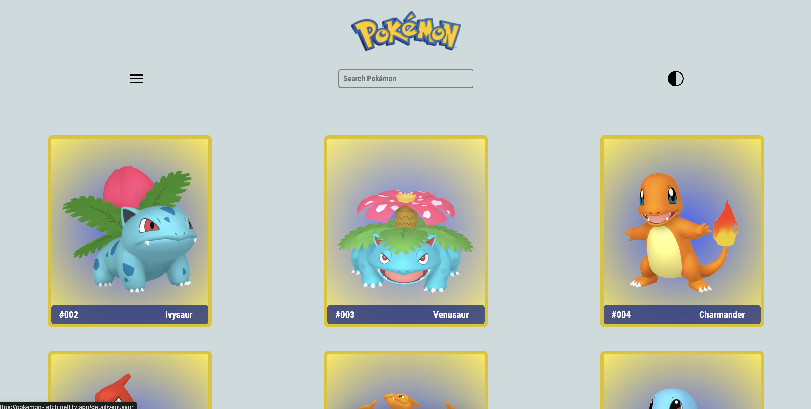

# pokeFetch

A website that features pokemon search and info functionality consuming the Poke-Api.

Part of coding exercise for SuperCode Bootcamp.

## Authors

- [@johannahaer](https://github.com/JohannaHaer)
- [@bwalyaa](https://github.com/Bwalyaa)
- [@digitalflowerstudio](https://www.github.com/digitalflowerstudio)

## Demo

https://pokemon-fetch.netlify.app/

## Screenshots

## Tech Stack

**Client:** React, Netlify, Axios, Poke Api, HTML, CSS, Javascript
